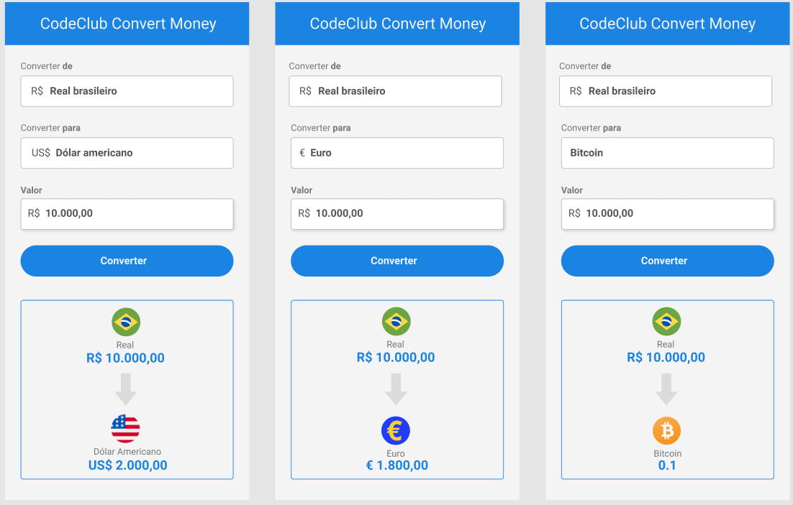

# currency-converter

> Programa que converte a moeda em Real para as opções: DOLAR, EURO e BITCOIN.

### Projeto Finalizado
O projeto foiá finalizado utilizando as seguintes tecnologias:

- [x] HTML5
- [x] CSS
- [x]  JavaScript

## Instalação e execução do conversor

- VSCode
- Extensão "Live Server";
  - Clicar com botão esquerdo em cima do arquivo "index.html";
    - Selecionar a moeda que deseja converter (dolar, euro ou bitcoin);
      - Preencher com o valor desejado;
        - Clicar no botão "Converter"
        
## 🤝 Colaborador

<table>
  <tr>
    <td align="center">
      <a href="https://github.com/daancorrea">
         
        
          <b>Daniel Correa</b>
        
      </a>
    </td>
</table>

*Valor de Dolar, Euro, Bitcoin pode ser alterado no arquivo "script.js"
